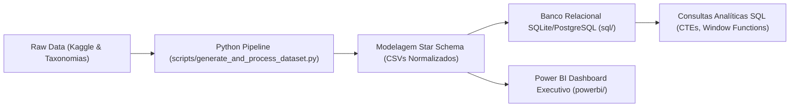

# 🤖 AI WorkShift 2030: O Impacto da IA no Mercado Global de Trabalho
> **Análise Quantitativa de Disrupção Salarial, Elevação de Escolaridade e Risco de Automação**

[](https://www.python.org/)
[](sql/)
[](powerbi/)
[](https://www.kaggle.com/datasets/khushikyad001/ai-impact-on-jobs-2030)

---

## 📖 A História por Trás dos Dados: O Seu Papel como Protagonista

* **🏢 A Empresa:** Você atua como Analista de Dados e People Analytics na **Nexus Global Consulting**, uma das maiores consultorias internacionais especializadas em reestruturação organizacional e futuro do trabalho.
* **⚠️ O Conflito de Negócio:** A diretoria de Recursos Humanos de um grande cliente corporativo está sob forte pressão diante de manchetes alarmistas prevendo demissões em massa por Inteligência Artificial. Ao mesmo tempo, colaboradores estão desengajados por incerteza e a área de Treinamento & Desenvolvimento possui um orçamento de R$ 15 milhões, mas não sabe onde alocar: *devem financiar pós-graduações tradicionais ou investir em microcredenciais práticas de Prompt Engineering e MLOps?*
* **🎯 A Sua Missão:** Desmistificar o "hype" com dados empíricos. Você foi incumbido de analisar mais de 3.700 dados de salários reais e projeções ocupacionais para entregar à Diretoria Executiva um diagnóstico analítico irrefutável: provar quais funções estão sendo **amplificadas** (ganhando aumentos salariais e expandindo vagas), quais estão sendo **comoditizadas** (sofrendo retração salarial) e como a exigência de diploma formal está dando lugar ao fenômeno do *Degree Escalation*.

---

## 📌 1. Visão Geral do Projeto & Perguntas de Negócio

Com a proliferação acelerada de modelos generativos, agentes autônomos e sistemas analíticos preditivos, líderes executivos, gestores de Recursos Humanos (People Analytics) e profissionais enfrentam a incerteza de como a força de trabalho será remodelada até 2030.

Este projeto desenvolve uma **análise ponta a ponta (End-to-End Data Pipeline)** utilizando dados fundamentados no dataset público do Kaggle (*AI Impact on Jobs 2030*), dados de ocupações do Bureau of Labor Statistics (BLS) e taxonomias do O*NET, com o objetivo de responder:
1. **O nível de exigência de escolaridade e qualificação aumentou ou diminuiu após o choque de IA?**
2. **Qual a magnitude da variação salarial e do volume de vagas entre o período pré-IA (2020) e a projeção pós-IA (2030)?**
3. **Quais profissões e setores concentram o maior risco de deslocamento (*displacement*) versus oportunidade de amplificação (*augmentation*)?**

---

## 💡 2. Principais Descobertas & Insights de Negócio

* 📈 **Bifurcação Salarial (+21.9% vs. -11.2%):** Ocupações no cluster de *Baixo Risco (Amplificação Humana)* tiveram aumento salarial médio de **+21.95%** (salários médios subiram de \$155.5k para \$190.8k). Em contraste, ocupações de *Alto Risco de Automação* sofreram compressão salarial média de **-11.21%**.
* 📉 **Contração Crítica de Vagas (-38.5%):** O volume de postos de trabalho para funções rotineiras encolheu em média **-38.49%**, enquanto funções com habilidades de orquestração de IA cresceram **+21.92%**.
* 🎓 **Escalação de Credenciais (*Degree Escalation*):** Em **39.28%** dos postos de trabalho analisados, houve aumento na exigência formal de instrução (ex: cargos que exigiam ensino médio passaram a exigir formação técnica/superior para operar sistemas de IA com supervisão crítica).
* 🏆 **Top Vencedores em Remuneração:**
  - *Quantitative Portfolio Manager* (+35.16% salarial | +26.89% em vagas)
  - *Machine Learning Engineer* (+31.91% salarial | +45.53% em vagas)
  - *Biomedical Research Scientist* (+29.63% salarial | +32.79% em vagas)
* ⚠️ **Top Ocupações Sob Pressão de Deslocamento:**
  - *Bank Branch Teller* (-16.28% salarial | -53.51% em vagas)
  - *Copywriter & Content Creator* (-15.25% salarial | -38.69% em vagas)
  - *Medical Records Coder* (-14.09% salarial | -48.31% em vagas)

---

## 🏗️ 3. Arquitetura da Solução & Stack Tecnológica



- **Linguagem & Manipulação:** Python (Pandas, NumPy, SQLite3).
- **Engenharia de Dados:** Modelagem Dimensional (Star Schema com 1 Tabela Fato e 3 Dimensões).
- **Camada Analítica SQL:** Consultas com CTEs, Agregações Ponderadas, `ROW_NUMBER()`, `NTILE()` e Particionamento.
- **Visualização & BI:** Power BI com medidas avançadas em DAX e matriz de dispersão de quadrantes.

---

## 🗄️ 4. Modelo Dimensional (Star Schema)

O banco de dados foi normalizado para garantir eficiência analítica máxima:

```
[dim_cargo] 1 --------< [fato_ai_job_impact] >-------- 1 [dim_setor]
(Cargo_ID, Job_Title,             |                  (Setor_ID, Industry)
 Industry, Skill)                 |
                                  v 1
                          [dim_escolaridade]
                    (Escolaridade_ID, Nivel, Grau)
```

- **`fato_ai_job_impact`**: Contém 3.200 registros detalhando volume de vagas pré e pós-IA, salários nominais em dólares, índices de exposição à IA (0 a 1) e probabilidades estimadas de automação.
- **`dim_cargo`**, **`dim_setor`**, **`dim_escolaridade`**: Fornecem enriquecimento contextual e navegação em drill-down no Power BI.

---

## 📊 5. Estrutura do Dashboard no Power BI

O relatório no Power BI foi projetado seguindo as melhores práticas de Storytelling e UX/UI:

| Página | Nome da Visão | Objetivo & Principais Visuais |
| :--- | :--- | :--- |
| **01** | **Balanço Líquido da IA** | Visão executiva macro: KPIs de Saldo de Vagas, Gráfico de Barras Divergentes por Setor e Donut de Risco. |
| **02** | **O Novo Filtro Educacional** | Barras 100% empilhadas confrontando Nível de Ensino vs. Categoria de Risco e Treemap de Habilidades Críticas. |
| **03** | **Matriz de Disrupção Salarial** | Scatter Plot com quadrantes 2x2 (*Risco de Automação vs. Crescimento Salarial*) destacando ocupações de alta amplificação vs. substituição. |
| **04** | **Simulador de Transição de Carreira** | Parâmetros What-If interativos permitindo simular o ROI de requalificação técnica (*upskilling*). |

---

## 🚀 6. Como Reproduzir Este Projeto Localmente

### Pré-requisitos
- Python 3.9+ instalado
- Power BI Desktop (opcional para abrir o relatório)

### Passo a Passo
```bash
# 1. Clonar o repositório
git clone https://github.com/seu-usuario/case-impacto-ia-trabalho.git
cd case-impacto-ia-trabalho

# 2. Executar o pipeline de dados (gera os dados e o star schema)
python scripts/generate_and_process_dataset.py

# 3. Validar e executar as queries SQL no banco SQLite
python scripts/run_sql_validation.py

# 4. Conectar o Power BI
# Abra o Power BI Desktop -> Obter Dados -> Texto/CSV -> Selecione os arquivos na pasta data/
# Aplique os relacionamentos e copie as medidas documentadas em powerbi/powerbi_dashboard_specification.md
```

---

## 📂 Estrutura de Arquivos do Repositório

```
case-01-impacto-ia-trabalho/
├── data/
│   ├── ai_impact_consolidated.csv  # Tabela desnormalizada ampla
│   ├── fato_ai_job_impact.csv       # Tabela fato do Star Schema
│   ├── dim_cargo.csv                # Dimensão cargos e skills
│   ├── dim_setor.csv                # Dimensão setores econômicos
│   ├── dim_escolaridade.csv         # Dimensão níveis de ensino
│   └── ai_impact.db                 # Banco de dados SQLite indexado
├── sql/
│   ├── 01_create_schema_and_tables.sql  # DDL Star Schema
│   └── 02_analytical_queries.sql        # Queries analíticas (Window functions)
├── scripts/
│   ├── generate_and_process_dataset.py  # Pipeline ETL e estatísticas
│   └── run_sql_validation.py            # Runner de validação SQL
├── powerbi/
│   └── powerbi_dashboard_specification.md # Guia de DAX e design do dashboard
└── README.md                        # Documentação executiva de portfólio
```

---

## 👤 Autor & Contato
- **Nome:** Seu Nome
- **LinkedIn:** [linkedin.com/in/seuperfil](https://linkedin.com)
- **Portfólio / GitHub:** [github.com/seuperfil](https://github.com)
